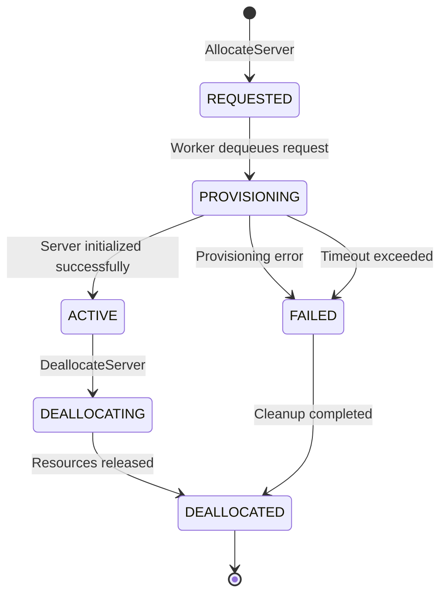

# DedicatedServerManager (DSM) API

> **Portfolio Sample Documentation**  
> This document describes a simplified, non-proprietary version of an internal
> service used to demonstrate API documentation practices and distributed
> systems concepts.

---

## Overview

The DedicatedServerManager (DSM) is an internal backend service responsible for
allocating, tracking, and deallocating short-lived dedicated game server
instances.

DSM provides a synchronous HTTP API for requesting server resources while
handling the underlying provisioning process asynchronously. Server allocation
requests are queued and processed by background workers that interact with a
third-party hosting provider.

This design allows client services to request dedicated servers without blocking
on potentially long-running provisioning operations.

---

## Problem Statement

Dedicated game servers may take several seconds to initialize due to external
dependencies such as host provisioning, image startup time, and network
configuration.

Client services need a reliable way to request server instances without blocking
on initialization, while still being able to query server status and connection
details once provisioning is complete.

The DedicatedServerManager addresses this by separating request acceptance from
server provisioning, using an asynchronous workflow to manage server lifecycles.

---

## Architecture Summary

At a high level, DSM consists of:

- A synchronous HTTP API for accepting allocation and deallocation requests
- A persistent work queue used to track server provisioning tasks
- A background worker (daemon) that polls the queue and performs provisioning actions
- Integration with a third-party hosting provider responsible for server startup

The API layer records desired state, while background workers reconcile desired
state with actual infrastructure state.

---

## Server Lifecycle Model

Server instances managed by DSM progress through a defined set of states.

### States

| State | Description |
|------|-------------|
| `REQUESTED` | Allocation request accepted and queued |
| `PROVISIONING` | Background worker is provisioning the server |
| `ACTIVE` | Server is running and ready to accept connections |
| `DEALLOCATING` | Server shutdown has been requested |
| `DEALLOCATED` | Server resources have been released |
| `FAILED` | Provisioning failed or timed out |

State transitions are monotonic; servers do not return to earlier states once
progressed.

---

## Lifecycle Diagram



The DSM lifecycle is driven by asynchronous background workers. Client-facing API
calls record desired state, while workers reconcile that desired state with actual
infrastructure state. Clients observe state transitions via polling.

---

## Asynchronous Allocation Model

Server allocation is intentionally non-blocking.

A successful allocation request indicates that the request has been accepted and
queued, not that a server is immediately available.

Clients are expected to poll DSM for server status and connection details using
`GetServerOptions` until the server reaches the `ACTIVE` state or a terminal
failure state.

---

## API Endpoints

### AllocateServer

**POST /AllocateServer**

Initiates the provisioning of a new dedicated game server instance.

This endpoint is **non-blocking**.

#### Request Body

```json
{
  "buildId": "string",
  "region": "string",
  "sessionId": "string"
}
```

| Field | Type | Required | Description |
|-----|----|----|----|
| `buildId` | string | Yes | Identifier for the server build or image to launch |
| `region` | string | Yes | Target region for server allocation |
| `sessionId` | string | Yes | Client-defined identifier used to correlate allocation requests |

#### Response

**202 Accepted**

```json
{
  "requestId": "dsm-req-7f3c2a",
  "status": "REQUESTED"
}
```

A `202 Accepted` response indicates that the allocation request has been recorded
and queued. The server may not exist yet at the time of response.

#### Error Responses

| Status | Description |
|------|-------------|
| 400 Bad Request | Invalid or missing request parameters |
| 409 Conflict | Allocation already exists for the given `sessionId` |
| 500 Internal Server Error | Failed to record allocation request |

---

### AllocateServer Idempotency

Allocation requests are idempotent with respect to `sessionId`.

Repeating an identical `AllocateServer` request with the same `sessionId` will
return the existing allocation record, allowing clients to safely retry requests
in the presence of transient failures.

---

### GetServerOptions

**GET /GetServerOptions**

Retrieves the current status and connection details for a previously requested
server.

#### Query Parameters

| Name | Type | Required | Description |
|----|----|----|----|
| `sessionId` | string | Yes | Identifier provided during allocation |

#### Response

**200 OK**

```json
{
  "sessionId": "session-abc123",
  "status": "ACTIVE",
  "ipAddress": "203.0.113.42",
  "port": 7777
}
```

Connection details are only present when the server state is `ACTIVE`.

#### Error Responses

| Status | Description |
|------|-------------|
| 404 Not Found | No allocation exists for the given `sessionId` |
| 500 Internal Server Error | Failed to retrieve server status |

---

### DeallocateServer

**POST /DeallocateServer**

Requests shutdown and cleanup of a previously allocated server.

#### Request Body

```json
{
  "sessionId": "string"
}
```

#### Response

**202 Accepted**

```json
{
  "sessionId": "session-abc123",
  "status": "DEALLOCATING"
}
```

Deallocation is performed asynchronously. A successful response indicates that
shutdown has been requested, not that resources have already been released.

---

## Data Consistency & Guarantees

- Allocation and deallocation requests are recorded atomically.
- Server state transitions are eventually consistent with underlying
  infrastructure.
- DSM does not guarantee immediate reflection of infrastructure state changes.

---

## Non-Goals

DSM is not responsible for:

- In-game session management
- Player matchmaking
- Server health monitoring beyond lifecycle state
- Automatic scaling or capacity planning
